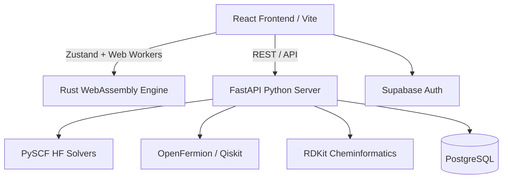

<div align="center">
  

  # 🌌 Alpha Paradox QC

  **Advanced Full-Stack Quantum Computing, Chemistry, and Molecular Simulation Platform**

  [](https://reactjs.org/)
  [](https://fastapi.tiangolo.com/)
  [](https://www.rust-lang.org/)
  [](https://supabase.io/)
  [](https://opensource.org/licenses/MIT)

  <p align="center">
    A unified environment bridging the gap between theoretical quantum mechanics, algorithmic chemistry, and drug discovery workflows.
  </p>
</div>

---

## 📖 Introduction

**Alpha Paradox QC** is a production-ready, deep-tech platform designed for researchers, computational chemists, and quantum computing engineers. The platform combines real-time quantum circuit synthesis, cloud-native high-performance simulation backends, and pharmaceutical drug discovery pipelines into a single seamless graphical interface. 

From dragging and dropping qubits into a VQE (Variational Quantum Eigensolver) to generating active space Hamiltonians natively compiled from PySCF—Alpha Paradox QC abstracts the complexities of quantum-chemistry while offering raw computational power through WebGPU and Rust/WebAssembly hardware acceleration.

---

## 🎯 Why This Project Exists

Current quantum computing ecosystems (like Qiskit or PennyLane) and computational chemistry toolkits (like PySCF or RDKit) are fundamentally fragmented. They exist as siloed CLI packages with massive learning curves. 

**Alpha Paradox QC** exists to solve this fragmentation by providing:
- **A Visual IDE:** Bringing deep-tech node-based workflows to quantum mechanics.
- **Hardware Agnosticism:** Running quantum jobs seamlessly across simulated and real-world QPU targets (e.g., IBM Quantum).
- **Scale-Ready Architecture:** Offloading heavy computations using Python executor threads, parallel Web Workers, and WebAssembly to prevent thread starvation and memory leaks.
- **End-to-End Drug Discovery:** Allowing pharmaceutical researchers to go from SMILES string -> 3D Topology -> Hartree-Fock Base -> Qubit Hamiltonian -> Quantum Simulation in minutes.

---

## ✨ Core Features

### ⚛️ Quantum Computing
- **Visual Circuit Builder:** Drag-and-drop qubits and quantum gates into a complex circuit IDE.
- **Real-Time Simulation:** Multi-backend simulation support (Dense state-vector, MPS Tensor Networks).
- **VQE Execution:** Optimize parameterized quantum circuits to find ground state energies natively.
- **Hardware Bridge:** Send natively compiled QASM jobs to IBM Quantum or simulated QPUs.

### 🧪 Quantum Chemistry & Drug Discovery
- **Visual Node Workflows:** Build end-to-end chemistry pipelines visually using React Flow.
- **SMILES Parsing:** Real-time 3D rendering of complex molecular structures.
- **Hartree-Fock / VQE Bridge:** Compute PySCF molecular ground states and map them to OpenFermion Hamiltonians.
- **ADMET Analysis & Lipinski's Rules:** Rapid drug likeness scoring, docking simulations, and pharmacological constraint validations.

---

## 🏗️ System Architecture

Our platform is structured on a loosely coupled microservice-inspired architecture designed for horizontal scaling and multi-threading capabilities.



### 💻 Tech Stack

| Domain | Technologies |
|---|---|
| **Frontend Core** | React 18, Vite, TypeScript, Tailwind CSS, Framer Motion |
| **State Management** | Zustand (Optimized with JSON delta compression) |
| **Visualization** | React Flow (`@xyflow/react`), Three.js, Recharts |
| **Backend Core** | Python, FastAPI |
| **Scientific Stack** | PySCF, RDKit, OpenFermion, Qiskit Nature, PennyLane |
| **Performance Layer** | Rust, WebAssembly (WASM), Web Workers, WebGPU |
| **Database & Auth** | Supabase, PostgreSQL, OAuth |
| **Deployment** | Vercel (Edge network), Uvicorn (Backend) |

---

## 📂 Folder Structure

```text
alpha-paradox-qc/
├── .github/                   # GitHub Actions and Workflows
├── chemistry-backend/         # Python FastAPI backend service
│   ├── routers/               # API endpoints (builder, vqe, simulation)
│   ├── requirements.txt       # Python dependencies
│   └── main.py                # Server entry point
├── quantum-core/              # Rust WebAssembly tensor engine
│   ├── src/                   # Rust source code
│   └── Cargo.toml             # Rust package configuration
├── src/                       # React frontend source
│   ├── components/            # UI Components and ShadCN library
│   ├── lib/                   # Quantum bridging, utils, Web Workers
│   ├── store/                 # Zustand state management
│   ├── types/                 # Global TypeScript definitions
│   └── pages/                 # Routing views
├── scripts/                   # Migration, maintenance, and cleanup scripts
├── supabase/                  # Supabase local configuration and migrations
├── package.json               # NPM dependencies
├── vite.config.ts             # Vite proxy and build configuration
└── README.md                  # Project Documentation
```

---

## 🖼️ Screenshots

*Placeholders for upcoming application screenshots.*

> **Visual Circuit Builder IDE**
> 
> **

> **Molecular 3D Visualizer & Node Editor**
> 
> **

> **VQE Energy Convergence Dashboard**
> 
> **

---

## 🚀 Installation & Setup

### 1. Prerequisites
- Node.js `v18+`
- Python `v3.10+`
- Rust & Cargo (for WASM compilation)
- Supabase CLI (optional, for local DB testing)

### 2. Repository Setup
```bash
git clone https://github.com/your-org/alpha-paradox-qc.git
cd alpha-paradox-qc

# Install frontend dependencies
npm install
```

### 3. Environment Variables Setup
Create a `.env` file in the root directory. **Never commit this file to version control.**

```env
# Supabase Configuration
VITE_SUPABASE_URL=your_supabase_url
VITE_SUPABASE_ANON_KEY=your_supabase_anon_key
SUPABASE_SECRET_KEY=your_supabase_service_role_key

# Backend API
VITE_API_BASE_URL=http://localhost:8000
```

### 4. WASM Build Instructions (Rust)
Before running the frontend, compile the Rust quantum tensor engine to WebAssembly.
```bash
cd quantum-core
cargo install wasm-pack
wasm-pack build --target web --out-dir pkg
cd ..
```

### 5. Backend Setup Instructions (Python)
We recommend using a virtual environment to isolate the heavy scientific libraries.
```bash
cd chemistry-backend
python -m venv .venv

# Activate (Windows):
.venv\Scripts\activate
# Activate (Linux/Mac):
source .venv/bin/activate

pip install -r requirements.txt
```

### 6. Supabase Setup Guide
If you are managing the database locally, ensure your Supabase containers are running:
```bash
supabase start
supabase db push
```

### 7. Running Project Locally
You can run both the frontend and backend concurrently using our NPM scripts:
```bash
# This starts the Vite dev server and the Uvicorn Python backend automatically
npm run dev
```
- **Frontend:** `http://localhost:8080`
- **Backend Swagger API Docs:** `http://localhost:8000/docs`

---

## 🌐 Deployment Guide

### Vercel (Frontend)
The frontend is optimized for edge deployment on Vercel.
1. Connect your GitHub repository to Vercel.
2. Set the framework preset to **Vite**.
3. Add your `VITE_SUPABASE_URL` and `VITE_SUPABASE_ANON_KEY` to Vercel Environment Variables.
4. Deploy.

### Custom Cloud (Backend)
Due to the heavy nature of PySCF and RDKit, the backend should be deployed to a dedicated container registry (e.g., AWS ECS, Google Cloud Run, or Railway).
```bash
# Example Dockerfile build
cd chemistry-backend
docker build -t alpha-paradox-backend .
docker run -p 8000:8000 alpha-paradox-backend
```

---

## 🔌 API Overview

Our FastAPI backend provides several distinct REST modules under the `/chemistry` proxy:

- `POST /chemistry/generate-chemistry-circuit`: End-to-end translation of a SMILES molecule into a Pauli/Fermionic Hamiltonian and quantum ansatz.
- `POST /chemistry/vqe`: Executes a Variational Quantum Eigensolver optimization loop against a parameterized circuit.
- `GET /chemistry/backends`: Fetches live QPU availability (IBM Quantum / Mock systems).

All API endpoints are documented via OpenAPI and can be tested locally at `http://localhost:8000/docs`.

---

## ⚙️ Main Project Modules

1. **`quantumCircuitStore.ts`**: The central nervous system for the frontend IDE. Manages strict temporal state (Undo/Redo) using compressed JSON serialization to mitigate memory bloat, tracking qubits, gate matrices, and quantum topologies.
2. **`wasmSimulator.ts`**: The TypeScript bridge executing WebAssembly tensor calculations. Ensures memory safety using deterministic `finally` cleanup block protections.
3. **`builder.py`**: The heavy-lifting python router. Synchronous compute requests (like PySCF Hartree-Fock) are offloaded to native `asyncio` thread executors to prevent GIL blocking and FastAPI starvation.
4. **`quantumWorker.ts`**: A dedicated Web Worker that fully parallelizes real-time quantum circuit simulation away from the browser's main UI thread.

---

## ⚡ Performance Optimization Architecture

To achieve production-grade stability under complex quantum simulations, we have implemented several aggressive optimizations:
- **Zero UI-Thread Blocking:** All quantum simulations are dynamically offloaded to Web Workers.
- **WASM Memory Safety:** Rust-to-TypeScript WASM memory is strictly managed with localized engine `free()` handlers wrapped in `try/finally` blocks, preventing catastrophic permanent heap leaks.
- **Backend Thread Isolation:** CPU-bound PySCF/RDKit computations execute exclusively via `asyncio.get_running_loop().run_in_executor`, ensuring the FastAPI async loop remains highly responsive to concurrent clients.
- **Zustand History Compression:** Undo/Redo logic utilizes JSON delta-compression, preventing N-fold deep copy memory bloat across multi-hundred-gate quantum circuits.

---

## 🔒 Security Architecture

- **Strict `.gitignore` Policy:** Critical environment configurations (e.g., `.env`, `.local`) are fundamentally excluded from Git tracking to prevent secret leaks.
- **Supabase Row Level Security (RLS):** Database access is explicitly gated through Supabase RLS profiles matching specific authenticated User IDs.
- **Sanitized Inputs:** All incoming SMILES strings and computational topologies are aggressively parameterized in the backend to prevent arbitrary code execution or path traversal in Python.
- **Stateless Execution:** Compute instances (FastAPI) store no persistent temporal state, mitigating cross-tenant data poisoning.

---

## 🛤️ Future Roadmap

- [ ] **WebGPU Acceleration:** Native compilation of tensor contractions direct to client-side GPU units.
- [ ] **PennyLane Differentiation Bridge:** Implementing reverse-mode automatic differentiation in the UI for Quantum Machine Learning (QML) topologies.
- [ ] **Custom QPU Integration:** Integrating direct API channels to IonQ and Rigetti systems via AWS Braket.
- [ ] **Advanced Error Mitigation:** ZNE (Zero-Noise Extrapolation) built visually into the circuit pipeline.

---

## 🤝 Contribution Guidelines

We welcome contributions from the computational physics and software engineering community!

1. Fork the repository.
2. Create your feature branch: `git checkout -b feature/amazing-quantum-feature`.
3. Commit your changes strictly following conventional commit syntax.
4. Ensure all typechecks (`npm run typecheck`) and builds pass natively.
5. Push to the branch and open a Pull Request.

---

## 📄 License

This project is licensed under the **MIT License**. See the `LICENSE` file for details.

---

## 👨‍💻 Author

**Alpha Paradox Core Engineering Team**  
Built by physicists and full-stack architects pushing the envelope of applied quantum algorithms.

<div align="center">
  <br />
  <i>Made with precision, physics, and lots of caffeine.</i>
  <br />
  <a href="https://github.com/your-org/alpha-paradox-qc">View Repository on GitHub</a>
</div>
